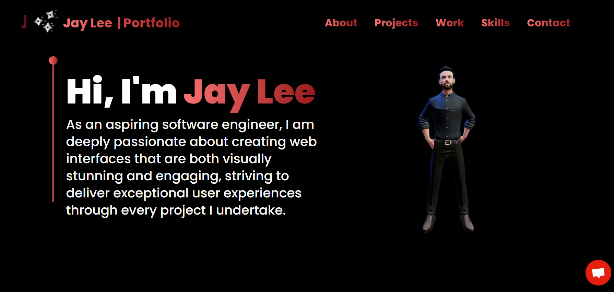

# Build and Deploy a Fantastic 3D Portfolio Website with Three.js and React.js

## Introduction
The most impressive websites in the world use 3D graphics and animations to bring their content to life. Learn how to build your own ThreeJS 3D Developer Portfolio today! 

## Features
- ThreeJS - a powerful 3D graphics library for rendering and animating the 3D model
- React Three Fiber - a popular library for creating 3D graphics with ThreeJS in React
- TailwindCSS - a popular utility-first CSS styling framework
- Framer Motion - the most popular library used to bring your React website to life with animations
You'll also learn how to:
- Load, create and customize stunning 3D models and geometries with various lights, as well as understand the 3D world with a camera and positioning of an object in space.
- Make your code reusable and scalable using Higher Order Components (HOCs) and other industry-standard best practices
- Implement sending emails through a form on the website
- Ensure responsiveness across all devices and improve your site's performance using Suspense and Preload.

## Getting Started
To get a local copy of the project up and running on your machine, follow these steps:

1. Clone the repository to your local machine using the following command:
git clone https://github.com/7ay-Lee7/your-project.git

2. Navigate to the project directory:
cd your-project-name

3. Install the project dependencies using npm:
npm install

4. Start the development server:
npm run dev

This will start the server and then you can open the project in your default browser.

That's it! You should now be able to make changes to the project and see them reflected in the browser.

## Credits
[JavaScript Mastery Channel](https://www.youtube.com/watch?v=0fYi8SGA20k&t=8985s) that helped me build my portfolio and learn new skills along the way.

## Add-ons
I have adapted the code to include a .env file for my details using [emailjs](https://www.emailjs.com/), which you will need to create in your root directory, mine is laid out like the following:

* VITE_APP_EMAILJS_SERVICE_ID=(Enter your Service ID here)
* VITE_APP_EMAILJS_TEMPLATE_ID=(Enter your Template ID here)
* VITE_APP_EMAILJS_PUBLIC_KEY=(Enter your public key here)
* MY_EMAIL=(Enter your email address ) I found using Gmail was the easiest way to get this setup via [emailjs](https://www.emailjs.com/)

## License
A callout for the 3d imagery:
### Model Information:
* title: Earth with Mountains & Atmosphere
* source:	[https://sketchfab.com/3d-models/stylized-planet-789725db86f547fc9163b00f302c3e70](https://sketchfab.com/3d-models/earth-with-mountains-and-atmosphere-97ecc0ebec5d41088811e993bc764a81)
* author:	CHRIS .capycoil (https://sketchfab.com/capycoil)

Happy coding 😊
